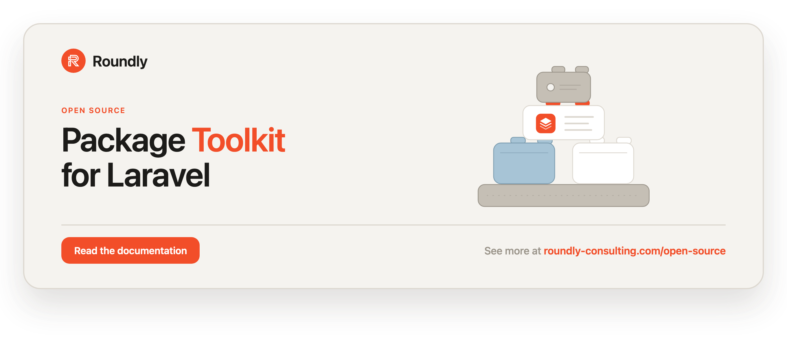

<!-- roundly-hero:start -->
<p align="center">
  <a href="https://roundly-consulting.com/open-source/docs/package-toolkit-for-laravel?utm_source=github&utm_medium=readme&utm_campaign=open-source&utm_content=package-toolkit-for-laravel">
    
  </a>
</p>
<!-- roundly-hero:end -->

<!-- roundly-badges:start -->
<p align="center">
  <a href="https://packagist.org/packages/roundly-consulting/package-toolkit-for-laravel"></a>
  <a href="https://github.com/roundly-consulting/package-toolkit-for-laravel/actions/workflows/run-tests.yml"></a>
  <a href="https://github.com/roundly-consulting/package-toolkit-for-laravel/actions/workflows/fix-php-code-style-issues.yml"></a>
  <a href="https://donate.stripe.com/dRmeVe8FX5PF1Qd9pXcEw00"></a>
  <a href="https://www.patreon.com/cw/roundly"></a>
  <a href="https://roundly-consulting.com/support-us?utm_source=github&utm_medium=readme&utm_campaign=open-source&utm_content=package-toolkit-for-laravel#crypto"></a>
</p>
<!-- roundly-badges:end -->

# Package Toolkit for Laravel

A native, dependency-free toolkit for building Laravel packages. It gives you a
fluent package-bootstrap builder, key-type aware schema macros, and small
database/config/model helpers — using only official Laravel and Symfony APIs.

- **Fluent bootstrap builder** — declare a package's config, migrations, views,
  translations, routes, commands, aliases, and `about` contributions; the base
  provider emits every `runningInConsole()`-gated `publish`/`load`/`commands`
  call once.
- **`KeyType` + Blueprint macros** — one config-driven key strategy
  (`bigint`/`uuid`/`ulid`) with `ownerKey()`, `morphKey()`, `auditable()`, and
  `polymorphicSubject()` schema macros.
- **Database helpers** — a `DatabaseDriver` enum, an injection-safe
  `whereLikeEscaped()` search that works on every Laravel database driver,
  config accessors (validate-or-throw, a strict enum accessor, lenient
  fall-back variants, and an array-validating entry point), and a model
  resolver.

## Requirements

- PHP 8.4+
- Laravel 12 or 13

## Installation

```bash
composer require roundly-consulting/package-toolkit-for-laravel
```

The package ships no config, migrations, or assets of its own — it is a library
that your package's service provider builds on.

## The package builder

Extend `PackageServiceProvider` and describe what your package ships in
`configurePackage()`. Everything console-gated is wired for you.

```php
use RoundlyConsulting\PackageToolkit\Package;
use RoundlyConsulting\PackageToolkit\PackageServiceProvider;

final class CommentsServiceProvider extends PackageServiceProvider
{
    public function configurePackage(Package $package): void
    {
        $package
            ->name('comments')
            ->hasConfigFile()
            ->hasMigrations()
            ->hasTranslations()
            ->hasCommands([PruneCommentsCommand::class])
            ->contributesToAbout();
    }
}
```

The base provider computes the package root from the provider's own location
(`src/…ServiceProvider.php` → package root). Override `resolvePackageBasePath()`
for a non-standard layout.

### Builder methods

| Method | What it does |
| --- | --- |
| `name(string $name)` | The package handle. Drives config keys, view/translation namespaces, and publish tags. |
| `hasConfigFile(?string $file = null)` | Merge + publish a config file. Defaults to `<name>.php` (key `<name>`, tag `<name>-config`). |
| `hasMigrations()` | Publish every `database/migrations/*.php` file under `<name>-migrations`, each timestamp-injected and kept in the directory's order. Nothing is auto-loaded — see below. |
| `hasMigration(string $name)` | Publish a single `database/migrations/<name>.php.stub` under `<name>-migrations`, timestamp-injected. Use only for a `.php.stub` source; `.php` files are picked up by `hasMigrations()`. |
| `hasTranslations()` | Load + publish translations (published to `lang/vendor/<name>`, tag `<name>-translations`). |
| `hasViews(?string $namespace = null)` | Register + publish Blade views (namespace defaults to `<name>`, tag `<name>-views`). |
| `hasRoutes(string $file, ?string $enabledVia = null)` | Load a route file (optionally gated behind a boolean config key) and publish it under `<name>-routes`. The switch is parsed like `Config::boolean()`: `false`/`0`/`'off'`/`'no'`/`'false'`/`''` skip the file; `true`/`'1'`/`'on'`/`'yes'`, an absent key or an unparseable value load it. |
| `hasCommands(array $commands)` | Register console commands (console only). |
| `hasFacadeAlias(string $class, ?string $configKey = null)` | Register a class alias. The config value decides: `null` or a false-like value (`false`/`0`/`''`/`'0'`/`'false'`/`'off'`/`'no'`) skips it, any other non-empty string renames it, `true`/`'1'`/`'on'`/`'yes'` or an absent key (or any unrecognized value) use the class's base name. |
| `contributesToAbout(?Closure $data = null)` | Add a section to `php artisan about`. |
| `publishesStubs(string $from, string $to, string $tag)` | Publish an arbitrary set of files under a custom tag. |

### Migrations are publish-only

A package built on the toolkit **never auto-loads its migrations**. The host
publishes them and runs the migrator:

```bash
php artisan vendor:publish --tag=comments-migrations
php artisan migrate
```

Each file is published to `database/migrations/<Y_m_d_His>_<name>.php`, so it
orders against the host's own migrations. When a package ships several
migrations, their timestamps step forward one second per file **in the package
directory's order**, so migrations that depend on each other's tables still run
in the right sequence. Any timestamp the package itself prefixed its source file
with is replaced by the publish timestamp.

Republishing is safe: the destination resolver reuses the file the migration was
already published to, so `vendor:publish --tag=comments-migrations --force`
overwrites in place instead of dropping a second, differently timestamped copy of
the same `Schema::create()`.

A file only counts as the earlier copy when it has the same name **and** the
package source's contents (whitespace differences such as line endings are
ignored). A same-named migration with different contents — your app's own
`create_comments_table`, another package's, or a copy you edited after
publishing — is never overwritten, not even with `--force`: the package's
migration is published beside it under a fresh timestamp, and you decide which
one to keep.

A package's own test suite must therefore run its migrations explicitly (e.g.
`$this->loadMigrationsFrom(__DIR__.'/../database/migrations')` in `TestCase`).

### Register-time helpers

`register()` stays overridable for bespoke bindings — override it and call
`parent::register()` first:

```php
public function register(): void
{
    parent::register();

    // Bind a contract to the class named in config, with a default.
    $this->bindFromConfig(CommentRepository::class, 'comments.repository', EloquentCommentRepository::class);
}

public function boot(): void
{
    parent::boot();

    // Attach an observer to the model named in config.
    $this->observesModel('comments.models.comment', CommentObserver::class);
}
```

### Opt-in traits

Each trait centralizes an idempotency guard so a double-boot never clobbers or
double-registers anything.

```php
use RoundlyConsulting\PackageToolkit\Concerns\InteractsWithGates;
use RoundlyConsulting\PackageToolkit\Concerns\RegistersBladeDirectives;
use RoundlyConsulting\PackageToolkit\Concerns\RegistersBlueprintMacros;

final class CommentsServiceProvider extends PackageServiceProvider
{
    use InteractsWithGates;
    use RegistersBladeDirectives;
    use RegistersBlueprintMacros;

    public function boot(): void
    {
        parent::boot();

        $this->registerBlueprintMacros();                      // ownerKey/morphKey/auditable/polymorphicSubject/whereLikeEscaped
        $this->registerBladeDirective('comment', $handler);    // no-op if already registered
        $this->registerBladeIf('commented', $condition);       // @commented(...) … @else … @endcommented
        $this->defineGate('manage-comments', $callback);       // left untouched if the host defined it
    }
}
```

## Key types & schema macros

Register the macros with `RegistersBlueprintMacros` (see above), then use them
in migrations. `KeyType` resolves the host's chosen key strategy from config —
a `KeyType` case or its (case-insensitive) string value — falling back
**silently** to `bigint` for any unrecognized value:

```php
use RoundlyConsulting\PackageToolkit\Enums\KeyType;

$type = KeyType::fromConfig('comments.key_type'); // KeyType::BigInt | KeyType::Uuid | KeyType::Ulid

Schema::create('comments', function (Blueprint $table) use ($type): void {
    $table->id();
    $table->ownerKey('author', $type);                 // FK column of the right type, indexed
    $table->morphKey('subject', $type);                // *_type / *_id morph pair (+ index)
    $table->polymorphicSubject('target', $type, true); // nullable morph pair
    $table->auditable();                               // timestamps() + softDeletes()
});
```

| Macro | Result |
| --- | --- |
| `ownerKey(string $name, KeyType $type, bool $nullable = false, bool $index = true)` | A single foreign-key column (`unsignedBigInteger`/`uuid`/`ulid`). |
| `morphKey(string $name, KeyType $type, bool $nullable = false)` | The correct `morphs`/`uuidMorphs`/`ulidMorphs` (+ nullable variants) pair. |
| `auditable()` | `timestamps()` + `softDeletes()`. |
| `polymorphicSubject(string $name, KeyType $type, bool $nullable = false)` | A polymorphic subject column pair. |

### Static analysis of the macros

A macro only exists once a service provider has booted — which PHPStan never
does — so `$table->morphKey(...)` would otherwise be an "undefined method"
error under Larastan. The toolkit ships a PHPStan extension that declares the
macros statically:

- `stubs/BlueprintMacros.stub` — the four `Blueprint` macros.
- `RoundlyConsulting\PackageToolkit\PHPStan\QueryMacrosExtension` — the
  `whereLikeEscaped()` macro on the query and Eloquent builders (both builder
  classes are already described by Larastan's own stub files, and only one stub
  per class is used, so these are contributed by reflection instead).

Both are registered in `extension.neon`, which
[`phpstan/extension-installer`](https://github.com/phpstan/extension-installer)
picks up automatically — nothing to configure. Without the installer, include it
by hand:

```neon
includes:
    - vendor/roundly-consulting/package-toolkit-for-laravel/extension.neon
```

## Database & config helpers

```php
use RoundlyConsulting\PackageToolkit\Enums\DatabaseDriver;
use RoundlyConsulting\PackageToolkit\Support\Config;
use RoundlyConsulting\PackageToolkit\Support\ModelResolver;

// Driver-aware branching. current() is for boot / console / migration paths
// that may fail loudly; on a request path use tryFrom() + a portable fallback,
// because the enum is closed while Laravel's driver set (e.g. sqlsrv) is not:
DatabaseDriver::current()->isPgsql();                                  // boot/console
DatabaseDriver::tryFrom($driver)?->isPgsql() ?? false;                 // request path

// Injection-safe "contains" search: ILIKE on Postgres, LIKE on every other
// driver (sqlsrv included), with the user's % _ \ escaped via ESCAPE '\'.
Comment::query()->whereLikeEscaped('body', $term);

// Validate-or-throw config accessors (throw InvalidConfigurationException).
Config::intBetween('comments.per_page', 1, 100, 20);                   // '20' from env → 20; '--5' or '1.5' throws
Config::requireString('comments.table');
Config::enum('comments.hash_algo', HashAlgorithm::class);              // strict: throws on a typo

// Lenient accessors: fall back to the default, never throw.
Config::enumOr('comments.key_type', KeyType::class, KeyType::BigInt);  // unknown value → KeyType::BigInt
Config::boolean('comments.enabled', true);                             // '1'/'true'/'on'/'yes' → true; 'ture' → the default

// Resolve + validate a model class from config.
$class = ModelResolver::for('comments.models.comment');       // class-string<Model>
$model = ModelResolver::newModel('comments.models.comment');
```

`whereLikeEscaped()` never throws for a driver the `DatabaseDriver` enum does not
model. On SQL Server it also escapes `[`, which T-SQL reads as a character class.
Case-insensitivity comes from `ILIKE` on Postgres; elsewhere it follows the
engine — SQLite's `LIKE` folds ASCII only, and MySQL, MariaDB and SQL Server
follow the column's collation (their default collations are case-insensitive).

Both enum accessors coerce the value to the enum's backing type first — every env
value is a string, so `'2'` resolves a case of an int-backed enum, and an int
resolves a numeric string-backed case. A value that cannot be coerced (`'2.0'`, a
float, a bool) is simply unrecognized: `enum()` throws, `enumOr()` falls back.
Neither ever lets a `TypeError` escape.

### Validating a DTO's input, with your own exception

The static accessors above read the **global config repository** by key. When a
DTO validates an array it was handed (a `fromArray()`), reading the repository
would let a value the caller never passed slip through — so start a validator
bound to that array with `Config::for()`. Nominate your package's own exception
class as the second argument and misconfiguration surfaces through *your*
hierarchy, not the toolkit's:

```php
use RoundlyConsulting\PackageToolkit\Support\Config;

final readonly class PasskeyConfig
{
    public static function fromArray(array $config): self
    {
        $v = Config::for($config, PasskeyException::class);

        return new self(
            timeout: $v->intBetween('timeout', 1, 300, 60),   // validates the 99999 you were handed
            trust: $v->enum('attestation', TrustMode::class), // a typo throws PasskeyException, never a silent downgrade
            rpId: $v->requireString('rp_id'),
        );
    }
}
```

`Config::using(MyException::class)` gives the same nominated-exception validator
while still reading the global repository, for config a package owns outright.

There is also a `ResolvesModels` trait (convenience over `ModelResolver`) and a
`HasRetryAfter` contract with a `ProvidesRetryAfter` trait for exceptions that
carry a retry-after hint.

## Exceptions

- `PackageToolkitException` — base for everything the toolkit throws.
- `InvalidConfigurationException` — a config value is missing, of the wrong
  type, out of range, not one of an enum's cases, or not a model class; also
  thrown by `DatabaseDriver::current()` for a driver the enum does not model.

## Migrating an existing package to the toolkit

1. Extend `PackageServiceProvider` instead of a hand-wired provider; move the
   `mergeConfigFrom`/`loadX`/`publishes`/`commands` tail into
   `configurePackage()`.
2. Delete the package's local `*KeyType` enum and driver magic strings; use
   `KeyType` + the schema macros and `DatabaseDriver`.
3. Replace any local `LikeEscaper`/config-guard/model-resolver copies with the
   toolkit's `Support\*` helpers.
4. Run the quality gate (`composer test`, `composer analyse`) and CI.

## Testing

```bash
composer test
```

<!-- roundly-support:start -->
## Support our work

This package is free and open source, built and maintained by
[Roundly Consulting](https://roundly-consulting.com/open-source?utm_source=github&utm_medium=readme&utm_campaign=open-source&utm_content=package-toolkit-for-laravel).
If it saves you time, please consider supporting our open-source work — a one-time donation, a
monthly pledge on Patreon or a crypto donation helps fund maintenance, new features and new
packages.

<a href="https://donate.stripe.com/dRmeVe8FX5PF1Qd9pXcEw00"></a>
<a href="https://www.patreon.com/cw/roundly"></a>
<a href="https://roundly-consulting.com/support-us?utm_source=github&utm_medium=readme&utm_campaign=open-source&utm_content=package-toolkit-for-laravel#crypto"></a>
<!-- roundly-support:end -->

## License

The MIT License (MIT). See [LICENSE.md](LICENSE.md).
